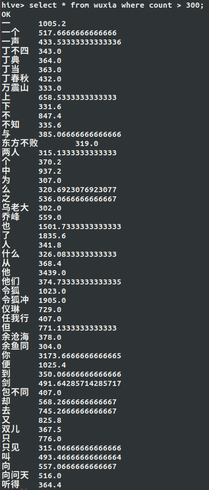

<center> <font color=#000000 size=6 face="黑体">大数据实验四  实验报告</font></center>

<center> <font color=#000000 size=4 face="宋体">白家杨 161220002   刘笑今 161220084   曹佳涵 161220003</font></center>

### 一、  实验任务

1. 在自己本地电脑上正确安装和运行HBase(推荐1.4.9)和Hive(推荐2.3.4)。

2. 在HBase中创建一张表Wuxia，用于保存下一步的输出结果。

3. 修改第3次实验的MapReduce程序，在Reduce阶段将倒排索引的信息通过文件输出， 而每个词语及其对应的“平均出现次数”信息写入到HBase的表“Wuxia”中。

4. 编写Java程序，遍历上一步中保存在HBase中的表，并把表格的内容(词语以及平 均出现次数)保存到本地文件中。

5. Hive安装完成后，在Hive Shell命令行操作创建表(表名:Wuxia(word STRING, count DOUBLE))、导入平均出现次数的数据、查询(出现次数大于300的词语)和 前100个出现次数最多的词。

### 二、实验环境说明

| JAVA 版本 | hadoop 版本  | HBase版本 | Hive版本 |
| :-------: | :----------: | :-------: | :------: |
| jdk-1.8.0 | hadoop-2.7.1 |   1.4.9   |  2.3.4   |

### 三、任务：修改MapReduce程序

在实验三中，我们已经完成了MapReduce框架来实现计算每个单词的倒排索引和平均出现次数，并写入HDFS中。这里只需要将平均出现次数写入到HBase中。写HBase的方法见教材。所以实际上我们只需要在Reduce阶段添加写HBase的操作。由于Reducer执行完Reducer中才得到平均出现次数，所以在Reducer中先建立一个Map来储存每个单词和平均出现次数的映射关系，Reduce阶段向Map中添加相应的数据，最终在cleanup阶段完成对HBase的输出。

Mapper实际代码如下（利用了自定义的Key值）：

```java
public class WriteHBase {

    //自定义属性
    public static String colfamily = "Content";//列族名
    public static String col = "average num";//列名
    public static String tablename = "Wuxia";//HBase表格名

    //定义组合key
    public static class WordType implements WritableComparable<WordType> {
        private String word;
        private String filename;

        public WordType() {

        }
		//初始化
        public WordType(String w, String f) {
            word = w;
            filename = f;
        }
		//获得其中的单词名
        public String GetWord() {
            return word;
        }
		//获得其中的文件名
        public String GetFilename() {
            return filename;
        }
		//设定单词
        public void SetWord(String w) {
            word = w;
        }
		//设置文件名
        public void SetFilename(String f) {
            filename = f;
        }

        //@Override
        //序列化
        public void write(DataOutput out) throws IOException {
            out.writeUTF(word);
            out.writeUTF(filename);
        }

        //@Override
        //反序列化
        public void readFields(DataInput in) throws IOException {
            word = in.readUTF();
            filename = in.readUTF();
        }

        //@Override
        //排序的根据
        public int compareTo(WordType o) {
            //return word.compareTo(o.word);

            if (word == o.word)
                return filename.compareTo(o.filename);
            else
                return word.compareTo(o.word);

        }

        @Override
        //用于Partition阶段，相同的word进入相同的Reducer
        public int hashCode() {
            return word.hashCode();
        }
    }
    public static class InvertIndexMapper extends Mapper<Object, Text, WordType, IntWritable> {
        public void map(Object key, Text value, Mapper.Context context) throws IOException, InterruptedException {
            FileSplit fileSplit = (FileSplit) context.getInputSplit();
            String filename = fileSplit.getPath().getName();//获得文件名
            //利用“.”将文件名切割
            String[] str = filename.split("\\.");
            String book = "";
            //去掉最后的.txt.segment，得到最终的文件名
            for (int i = 0; i < str.length - 3; i++)
                book += str[i] + ".";
            book += str[str.length - 3];
            //切割每一行为每个单词
            StringTokenizer itr = new StringTokenizer(value.toString());
            while (itr.hasMoreTokens()) {
                //对应单词和书名建立WordType类型的key
                WordType wordType = new WordType(itr.nextToken(), book);
                //输出键值对<WordType（包含单词和书名）,1>
                context.write(wordType, new IntWritable(1));
            }
        }
    }
}
```

在Mapper中，定义了常用的属性名比如列族名等以及key类型WordType，在Mapper中首先切割文件名中的后缀".txt.segment"，然后对每个单词建立一个WordType，记录对应的单词和书名，输出键值对<WordType（包含单词和书名）,1>便于下一步计算。

Reducer阶段代码如下：

```java
public static class WriteBoth2Reducer extends Reducer<WriteHBase.WordType, IntWritable, Text, Text> {
        //建立map来保存单词与平均出现次数的对应关系
        protected Map<String, Double> table = new HashMap<>();
        protected void setup(){
            table = new HashMap<>();
        }
        @Override
        public void reduce(WriteHBase.WordType key, Iterable<IntWritable> values, Context context)throws IOException,InterruptedException{
            double sum = 0;//出现次数和
            //建立书名和出现次数的映射关系
            Map<String, Integer> books = new HashMap<String, Integer>();
            //遍历value算出词频总和，建立书名和词频的映射关系
            for (IntWritable it : values) {
                int num = Integer.parseInt(it.toString());//得到出现次数
                sum += num;//次数和更新
                String bookname = key.GetFilename();//得到书名
                if (books.containsKey(bookname))//判断是否已经保存过这本书
                    //若保存过，更新出现次数
                    books.put(bookname, books.get(bookname) + num);
                else {
                    //未保存过，则向map中添加该映射关系
                    books.put(bookname, num);
                }
            }
            //得到平均出现次数
            double average = sum / (double) (books.size());
            String result = "";//输出倒排索引
            Iterator<String> iterator = books.keySet().iterator();
            //建立倒排索引
            while (iterator.hasNext()) {
                String k = iterator.next();
                result = result + (k + ":" + Integer.toString(books.get(k)) + "; ");
            }
            String word = key.GetWord();
            //向表格中添加<单词，平均出现次数>的映射关系
            table.put(word,new Double(average));
            //将倒排索引写入HDFS文件
            context.write(new Text(word), new Text(result));

        }
        protected void cleanup(Context context) throws IOException, InterruptedException {
            Configuration configuration = HBaseConfiguration.create();//得到hBase资源的Configuration
            configuration.set("hbase.zookeeper.quorum", "localhost");//设定zookeeper属性
            HBaseAdmin hBaseAdmin = new HBaseAdmin(configuration);
            HTable Htable = new HTable(configuration, WriteHBase.tablename);//根据表名得到对应的表
            List<Put> puts = new ArrayList<>();
            //遍历Map，对每个单词构造一个行加入list中
            for(Map.Entry<String, Double>entry : table.entrySet()){
                String word = entry.getKey();
                Double num = entry.getValue();
                //根据word的rowkey来实现put
                Put put = new Put(Bytes.toBytes(word));
                //根据列族名和列确定插入位置
                put.add(Bytes.toBytes(WriteHBase.colfamily), Bytes.toBytes(WriteHBase.col), Bytes.toBytes(num));
                puts.add(put);
            }
            //向表中添加
            Htable.put(puts);

            super.cleanup(context);
        }
    }
```

在Reducer中建立的记录单词和平均出现次数的Map命名为table，在reduce函数中正常计算出倒排索引和平均出现次数，其中倒排索引用`content.write`正常写到HDFS中，而单词和对应的平均出现次数则传入到Map类型的table中。在cleanup阶段，首先定义HBase对应的Configuration。由于这里我们使用的zookeeper是HBase自带的zookeeper，所以设定属性`"hbase.zookeeper.quorum"`,为"localhost"，具体可查HBase的属性设置文件来确定。并得到管理器HBaseAdmin。根据之前确定的列名和列族名等可定义HTable对应于一个表。将table中的映射关系建立出<rowkey,col,value>的关系，将Map转成List，List中储存的是Put表示一次向其中添加数值，每个Put记录的是rowkey（即单词）的Bytes形式，colfamily（即列族）的Bytes形式，col（即列名）的Bytes形式，value（即平均出现次数）的Bytes形式，最后HTable.put函数可以将List中的数值全部添加到表中。至此完成Hbase的输出。

### 四、任务：遍历HBase表并保存

#### 方法一：基于HBase的API

在上一个任务中，已经将倒排索引的数据存储到了HBase的Wuxia表中，列族名为Content，列名为average num。这个任务主要就是遍历HBase中的Wuxia表，将表中的内容保存到本地文件中。

遍历HBase表主要使用到的操作是扫描（scan）技术，它类似于数据库系统中的游标（cursor），并利用到了HBase提供的底层顺序存储的数据结构。扫描操作的工作方式类似于迭代器，所以用户无需调用 `scan()` 方法创建实例，只需要调用HTable的 `getScanner()` 方法，此方法在返回真正的扫描器（scanner）实例的同时，用户也可以使用它迭代获取数据。

扫描操作不会通过一次RPC请求返回所有匹配的行，而是以行为单位进行返回。在本次实验中，行的数目很大，如果同时在一次请求中发送大量数据，会占用大量的系统资源并消耗很长时间。因此使用 `ResultScanner` 类把扫描操作转换为类似的 `get` 操作，它将每一行数据封装成一个 `Result` 实例，并将所有的 `Result` 实例放入一个迭代器中，通过 `next()` 方法进行遍历。

实际代码如下：

```java
public class ScanTable {
    public static void main(String[] args) throws IOException {
        // 创建所需的配置
        Configuration conf = HBaseConfiguration.create();
        // 实例化一个新的客户端
        HTable table = new HTable(conf, "Wuxia");
        // 创建一个空的Scan实例
        Scan scan = new Scan();
        // 将限制条件添加到Scan中
        scan.addColumn(Bytes.toBytes("Content"), Bytes.toBytes("average num"));
        // 取得一个扫描器迭代访问所有的行
        ResultScanner scanner = table.getScanner(scan);
        try {
            // 创建新文件
            File file = new File("result.txt");
            if (!file.exists()) {
                // 若文件已存在则重新创建
                file.createNewFile();
            }
            // 创建fileWriter
            FileWriter fileWriter = new FileWriter(file.getName());
            // 遍历每一行的数据
            for (Result res : scanner) {
                // 取出KeyValue类对象
                for(KeyValue kv : res.raw()){
                    // 获取Row值和Value值，并写入文件
                    fileWriter.write(Bytes.toString(kv.getRow()) + "\t");
                    fileWriter.write(Bytes.toDouble(kv.getValue()) + "\r\n");
                }
            }
            // 关闭fileWriter
            fileWriter.close();
        } catch (IOException e) {
            e.printStackTrace();
        }
        // 关闭scanner
        scanner.close();
        // 关闭table
        table.close();
    }
}
```

在代码中，首先实例化一个HBase client，使用它来进行后续的api接口调用，在Scan实例中，需要指定列族名和列名，以保证只读入指定列族指定列的数据，通过扫描器迭代获取所有的行，将其存入 `ResultScanner` 实例中，并将其中的word和count数据取出，注意再上一个任务存入数据时word类型为 `string` ，count类型为 `double` ，因此在取出时，需要将取出的byte[]类型转换为相应的 `string` 和 `double` ，并将其写入文件。

#### 方法二：基于MapReduce框架

MapReduce框架也可用于对表的处理。`TableMapper`类继承自Mapper，传入map函数的键值对对应的是<rowkey,Result(包括列族名，列名，value)>，我们只需使用TableMapper和写HDFS的Reducer相结合，TableMapper输出的<rowkey（即单词）,value（平均出现次数）>传入Reducer中直接输出到HDFS文件中即可。

具体代码如下：

```java
public class ReadHBase {
    public static class ReadHBaseMapper extends TableMapper<Text, Text>{
        protected void map(ImmutableBytesWritable key, Result value, Context context)throws IOException, InterruptedException{
            //StringBuffer sb = new StringBuffer("");
            //key是rowkey， value是一个map of qualifiers to values
            for(Map.Entry<byte[], byte[]> entry: value.getFamilyMap(WriteHBase.colfamily.getBytes()).entrySet()){
                String str = new String(Bytes.toString(entry.getKey()));//将rowkey转成String
                Double num = (Bytes.toDouble(entry.getValue()));//得到平均出现次数
                String sb = num.toString();//将平均出现次数转成Double类型
                //输出（单词，平均出现次数）
                context.write(new Text(Bytes.toString(key.get())), new Text(sb));
            }
        }

    }
    public static class ReadHBaseReducer extends Reducer<Text, Text, Text, Text>{
        protected void reduce(Text key, Iterable<Text> values, Context context)throws IOException, InterruptedException{
            //key是单词，values是对应的平均出现次数
            for(Text val:values){
                //写入HDFS文件
                context.write(new Text(key.toString()), new Text(val.toString()));
            }
        }
    }
    public static void main(String[] args) throws Exception{
        String tablename = args[0];//得到表格名
        Configuration conf = HBaseConfiguration.create();//得到HBase对应的Configuration
        conf.set("hbase.zookeeper.quorum", "localhost");//设定zookeeper属性
        String input = args[1];//输入路径
        Job job = new Job(conf, "ReadHBase");//建立Job
        job.setJarByClass(ReadHBase.class);//Set the Jar by finding where a given class came from.
        FileOutputFormat.setOutputPath(job, new Path(input));//设定输出路径
        job.setReducerClass(ReadHBaseReducer.class);//设定Reducer的类
        Scan scan = new Scan();//创建Scan
        //初始化Mapper，与HBase联系起来
        TableMapReduceUtil.initTableMapperJob(tablename, scan, ReadHBaseMapper.class, Text.class, Text.class, job);
        System.exit(job.waitForCompletion(true)? 0:1);//等待任务结束并退出
    }
}
```

在Mapper中，我们得到的rowkey和Result中的内容都是Bytes类型，这与上一步我们写HBase表相一致，所以在得到后需要先转成String类型，再输出，便于在HDFS文件中阅读。

### 五、任务：Hive Shell表操作

配置好Hive后，首先建立一个wuxia表：

```mysql
create table wuxia (word STRING, count DOUBLE) row format delimited fields terminated by '\t' stored as textfile;
```

建表指令中，规定了表的两个属性为word和count，类型分别为字符串和double。该表可以从文件加载进来，对文件格式的要求是：每行一个条目(word count)，中间用'\t'隔开。

根据实验前一部分得到的数据文件，将数据文件导入wuxia表：

```mysql
load data inpath "/home/hadoop/data/result.txt" into table wuxia;
```

再执行：

```mysql
select * from wuxia;
```

即可看到所有条目，说明加载成功。

查找平均出现次数大于300的词语：

```mysql
select word from wuxia where count > 300;
```

查找平均出现次数最大的100的词语：

```mysql
select word from wuxia sort by count desc limit 100;
```

### 六、运行结果

#### HBase配置和Hive配置文件

HBase配置：

```xml
	   <property>
           <name>hbase.master.info.port</name>
           <value>16010</value>
       </property>
       <property>
           <name>hbase.rootdir</name>
           <value>hdfs://localhost:9000/hbase</value>
       </property>
       <property>
           <name>hbase.cluster.distributed</name>
           <value>true</value>
       </property>
       <property>
           <name>hbase.zookeeper.property.dataDir</name>
           <value>/home/hadoop/.zookeeper</value>
       </property>
```

Hive配置：

使用mysql进行Hive元数据的存储：

```xml
<property>
  	<name>javax.jdo.option.ConnectionURL</name>
    <value>jdbc:mysql://localhost:3306/hive?createDatabaseIfNotExist=true</value>
  </property>
  <property>
  	<name>javax.jdo.option.ConnectionDriverName</name>
  	<value>com.mysql.jdbc.Driver</value>
  </property>
  <property>
  	<name>javax.jdo.option.ConnectionUserName</name>
  	<value>root</value>
  </property>
  <property>
  	<name>javax.jdo.option.ConnectionPassword</name>
  	<value>root</value>
 </property>
<property>
    <name>hive.exec.local.scratchdir</name>
    <value>/tmp</value>
    <description>Local scratch space for Hive jobs</description>
  </property>
  <property>
    <name>hive.downloaded.resources.dir</name>
    <value>/home/hadoop/hive/warehouse</value>
    <description>Temporary local directory for added resources in the remote file system.</description>
  </property>
```

Hive配置还需要注意：

- 删除hive-site.xml中有关derby数据库的所有配置
- 需要初始化mysql中的hive元数据表，即：schematool -dbType mysql -initSchema

#### 同时写入HBase和HDFS

执行指令

```
sbin/hadoop jar <jar name>.jar WriteBoth2 <input file path> <output file path>
```


运行后HBase中的结果：


运行后HDFS文件：


#### 遍历HBase并保存


#### Hive Shell表操作

平均次数大于300的词语(部分)：



平均次数最多的100个词语(部分截图)：


### 七、实验体会

参考：

【1】<https://blog.csdn.net/sunnyyoona/article/details/51648871>

【2】<https://blog.csdn.net/qq_16633405/article/details/78278786>

【3】[Hbase ERROR: Table already exists](https://www.jianshu.com/p/e1767d57f972)

【4】[Hbase ERROR: ClassNotFoundException: Mapper](https://blog.csdn.net/qq_19648191/article/details/56684268)

【5】[MapReduce将文件内容写入Hbase](https://www.jianshu.com/p/ab20bb05e312)


